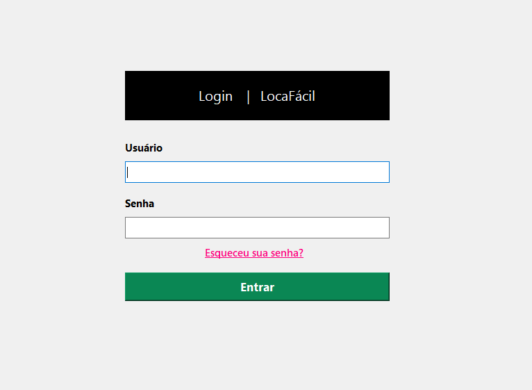

# Sistema para gerenciamento de vagas em imóveis

- O objetivo desse sistema é, facilitar o acesso, principalmente, a pessoas que não conhecem a cidade de Picos, no sentido de disponibilizar, de maneira simples, um catálogo com vários imóveis disponíveis, avaliando a média de preço, características geográficas e visualização geral do imóvel através de fotos anunciadas. Porém, esse sistema não será voltado somente para quem não conhece a cidade e sim para a sociedade em geral. 
- Os imóveis a serem cadastrados, serão de usuários devidamente cadastrados ao sistema e que tenham imóvel para dividir ou para aluguél integral.

## Das regras

- Os commits podem ser feitos em português ou inglês
- Todas as classes e funções devem ser documentadas
- A documentação deve ser realizada com base no [numpydoc docstring guide¶](https://numpydoc.readthedocs.io/en/latest/format.html)

## Requerimentos

- Python >= 3.6
- Pyqt na versão 5
- Qt Design 
- MySql na versão 5.7.28

## Funcionalidades 

- Cadastro de Usuário
- Cadastro de Imóvel
- Visualização de informações de Imóveis para Aluguél

## Do uso

- Clone o projeto github (https://github.com/spbdlelis/Projeto-Loca-Facil.git) 
- Para rodar o projeto, deve-se executar o arquivo Sever.py e depois o arquivo Root.py

## Tela Inicial

## Cadastro de Usuário

## Login 

## Recuperar Login

## Tela Principal do Sistema

## Cadastro de Imóvel

## Sobre os Desenvolvedores

## Contato com os Desenvolvedores

